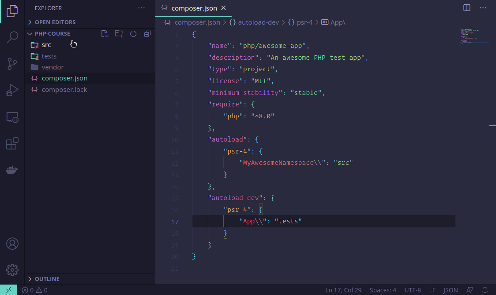

PHP Class
=========

An extension that allows you to create classes, interfaces and traits with
namespace information from your `composer.json`.

## Why?

VsCode is a good editor, but I've always struggled with the lack of features
in terms of PHP class creation and namespaces managements. Sometimes it can be
really tedious to add namespaces to your PHP files. I coded this extension to
save me that time when working in codebases with PSR-4 autoloading.

## Features

### Automatic PSR-4 Namespace Resolution

This extension understands your `composer.json` namespace structure and creates
your files in the righ directory with the correct namespace.

### Support for Classes, Interfaces and Traits

You can create either classes, interfaces and traits.

### Support for Remote Coding

This extension uses the new VsCode filesystem api so file creation works even
when working on remote contexts like WSDL or LiveShare.

### Composer.json file change detection

If you change your `composer.json`, the root namespace information is rebuilt.

## How To Use

1. Select `New PHP Class` from the context menu inside Explorer.
2. Enter the Fully Qualified Class Name (e.g. 'Foo\Bar\Baz') and press enter to proceed or enter escape to discard.
3. Choose wether the class file is going to be a class, and interface or a trait.
4. Enjoy!

## Roadmap

- Support for renaming classes and move them to the right namespace